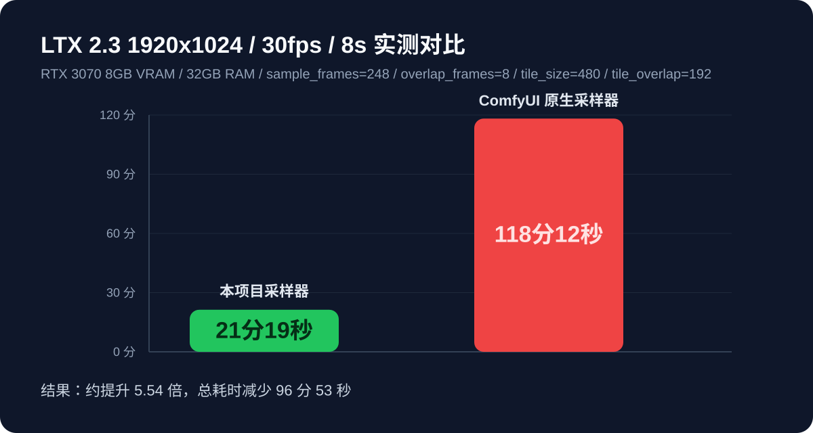

# ComfyUI LTX2 Tiled Sampler Custom Advanced

一个独立的 ComfyUI 自定义节点插件，用于在 LTX 2 系列工作流中替代原生 `SamplerCustomAdvanced`，并增加时间窗口采样与空间切块能力。

## 实测性能

以下为一组实际测试数据，供需要长视频生成的场景参考。

- 测试硬件：`RTX 3070 8GB` 显卡，`32GB` 内存
- 采样配置：`sample_frames=248`、`overlap_frames=8`、`tile_size=480`、`tile_overlap=192`
  - 注：这里填写的是前端输入值，必须为 `8` 的倍数；后台会先 `+1`，因此等价于旧配置的 `sample_frames=32`、`overlap_frames=2`（latent 帧）
- 输出规格：`1920x1024`、`30fps`、`8秒`

在上述配置下：

- 使用本项目采样器，完整生成一条目标视频耗时约 `21分19秒`
- 使用 ComfyUI 原生采样器，完整生成同规格视频耗时约 `118分12秒`

按这组实测结果计算，本项目在该场景下约可获得 `5.54 倍` 的速度提升，总耗时减少约 `96分53秒`。

> 说明：实际耗时仍会受到模型版本、工作流搭配、驱动环境、精度设置以及系统后台负载影响，以上数据更适合作为同类配置下的参考对比。

## 支持版本

- 已验证：`LTX 2.3`、`LTX 2.5`
- 预期兼容：其他 `LTX 2.x` 系列版本
- 说明：只要底层 latent 结构、采样接口以及 `LTXV` / `LTXAV` 输入约定保持兼容，本节点通常无需修改即可工作；不同版本仍建议先做一轮实际生成验证。

## 功能

- 保持原始 `SamplerCustomAdvanced` 的输入输出契约
- 支持 `LTXV` 与 `LTXAV` 两种 latent
- 支持按时间窗口采样，避免一次性把整段 latent 全部送入 transformer
- 支持按空间 tile 切块，并对重叠区域做线性权重融合
- 当无需时间窗口且无需空间切块时，自动退化为单次完整采样

## 节点

- 节点名：`LTX2TiledSamplerCustomAdvanced`
- 显示名：`LTX2 Tiled Sampler Custom Advanced`
- 分类：`model/sampling/custom`

## 参数

- `sample_frames` / `采样帧数`
  - 默认：`248`
  - 单位：`视频帧`
  - 含义：每个后续时间窗口新增的视频帧数
  - 输入必须为 `8` 的倍数
  - 后台会先对输入值执行 `+1`，再按 LTX 时间缩放比例转换到 latent 时间轴
  - 默认值按 `temporal_ratio=8` 折算后，等价于旧版默认 `32 latent 帧`

- `overlap_frames` / `时间重叠`
  - 默认：`24`
  - 单位：`视频帧`
  - 含义：时间窗口之间回看的历史视频帧数
  - 输入必须为 `8` 的倍数
  - 后台会先对输入值执行 `+1`，再按 LTX 时间缩放比例转换到 latent 时间轴
  - 默认值按 `temporal_ratio=8` 折算后，等价于旧版默认 `4 latent 帧`

- `tile_size` / `分片像素`
  - 默认：`512`
  - 单位：`像素`
  - 含义：空间分片大小
  - 内部会根据 latent 的空间缩放比例转换到 latent 空间

- `tile_overlap` / `重合像素`
  - 默认：`192`
  - 单位：`像素`
  - 含义：空间分片之间的重叠宽度
  - 内部会根据 latent 的空间缩放比例转换到 latent 空间
  - 转换后必须严格小于 tile 大小

## 时间窗口规则

- 节点显式暴露 `overlap_frames`
- `sample_frames` 与 `overlap_frames` 现在都直接输入视频帧数
- 输入值必须为 `8` 的倍数
- 后台会先执行：
  - `effective_video_frames = input_video_frames + 1`
- 再按 LTX 的时间缩放比例换算到 latent 时间轴：
  - `latent_frames = ((effective_video_frames - 1) // temporal_ratio) + 1`
  - `可覆盖视频帧数 = ((latent_frames - 1) * temporal_ratio) + 1`
- 因此用户输入值、后台实际参与换算的视频帧数，以及最终的 latent 帧数会是三套相关但不完全相同的数值
- 对于后续时间窗口，节点仍会复用上一窗口已经生成好的历史 latent，再把这段历史作为冻结上下文，仅继续更新新增帧

对于非首个时间窗口，代码会在视频分支前面额外补入一帧首时间切片，再在输出时移除，用于做当前实现中的 LTX 首帧因果补偿。

## 空间切块规则

- `tile_size` 与 `tile_overlap` 先从像素换算到 latent 空间
- 若换算后的 tile 已覆盖整个 latent 高宽，则不会启用空间切块
- 启用切块时，会分别在高、宽两个维度生成 tile 网格
- 重叠区域通过线性 ramp 权重融合，而不是简单覆盖

## 与原生 SamplerCustomAdvanced 的区别

原生节点是一次性对整段 latent 做采样；本插件的执行逻辑是：

1. 先为完整 latent 生成一次噪声
2. 先校验 `sample_frames` 和 `overlap_frames` 为 `8` 的倍数
3. 后台先对这两个输入值执行 `+1`
4. 再将它们从视频帧换算为 latent 时间窗口参数
5. 每个时间窗口内按需决定是否继续做空间切块
6. 空间 tile 输出经权重融合后回写当前窗口
7. 仅保留每个窗口的新增区域，再按时间顺序拼接成完整输出

如果当前 latent 不需要时间窗口，且 tile 也未小于 latent 尺寸，则直接走一次完整采样的 fast path。

## LTXAV 说明

在 `LTXAV` 模式下，节点要求输入是 `video + audio` 两分支的 `NestedTensor`。

- 视频分支支持时间窗口与空间切块
- 音频分支支持按时间窗口切分
- 视频窗口对应的音频窗口不是按固定帧数截取，而是按比例映射：
  - `scaled = index * audio_total / video_total`
  - 起点使用 `floor`
  - 终点使用 `ceil`

当当前时间窗口只有一个空间 tile 时，音视频会一起正常采样。

当当前时间窗口存在多个空间 tile 时，当前实现会：

1. 先使用首个 tile 运行一次联合采样，得到该时间窗口的音频结果
2. 把这份音频作为冻结音频复用到该窗口的所有 tile
3. 后续各 tile 只继续更新视频分支，音频分支通过 mask 保持不变
4. 最后仅对视频 tile 做空间融合，音频直接使用这份冻结结果

也就是说，当前代码逻辑已经不是“每个 tile 都重新生成音频后取第一个”，而是“先生成一次整窗音频，再冻结音频，只对视频做空间分块”。

## 安装

将本插件目录放入 ComfyUI 的 `custom_nodes` 下，或以软链接方式挂载到该目录，然后重启 ComfyUI。
